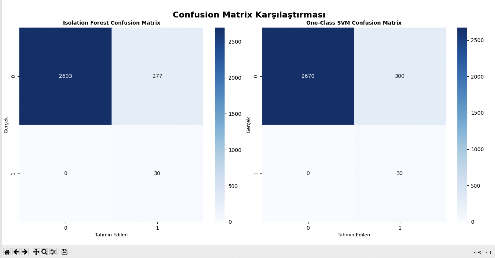

# Anomali Tespit Projesi

Bu proje Kadir Can Felek tarafından tamamlanmıştır.

## Proje Hakkında

Bu proje, kredi kartı sahtekarlık tespiti için iki farklı anomali tespit algoritmasını karşılaştırır:
- **Isolation Forest**: Ağaç tabanlı anomali tespit algoritması
- **One-Class SVM**: Destek vektör makinesi tabanlı anomali tespit algoritması

## Proje Yapısı

```
anomaly_detection_project/
├── config/
│   └── config.py                 # Konfigürasyon ayarları
├── data/
│   └── creditcard.csv           # Veri seti (indirilmeli)
├── models/
│   ├── __init__.py
│   ├── isolation_forest_model.py # Isolation Forest model sınıfı
│   └── one_class_svm_model.py   # One-Class SVM model sınıfı
├── services/
│   ├── __init__.py
│   ├── data_preprocessing_service.py # Veri ön işleme servisi
│   └── model_trainer_service.py     # Model eğitimi servisi
├── utils/
│   ├── __init__.py
│   ├── evaluation_utils.py       # Değerlendirme fonksiyonları
│   └── visualization_utils.py    # Görselleştirme fonksiyonları
├── main.py                       # Ana uygulama
├── download_data.py              # Veri seti indirme scripti
├── requirements.txt              # Python bağımlılıkları
└── README.md                     # Bu dosya
```

## Kurulum

1. **Bağımlılıkları yükleyin:**
   ```bash
   pip install -r requirements.txt
   ```

2. **Veri setini indirin:**
   ```bash
   python download_data.py
   ```
   
   Veya manuel olarak:
   - https://www.kaggle.com/datasets/mlg-ulb/creditcardfraud adresinden veri setini indirin
   - `creditcard.csv` dosyasını `data/` klasörüne kopyalayın

## Kullanım

Projeyi çalıştırmak için:

```bash
python main.py
```

## Özellikler

### Model Eğitimi
- Isolation Forest ve One-Class SVM modellerinin eğitimi
- Otomatik veri ön işleme ve normalleştirme
- Stratified train-test split

### Değerlendirme Metrikleri
- Accuracy (Doğruluk)
- Precision (Kesinlik)
- Recall (Duyarlılık)
- F1 Score
- ROC AUC Score

### Görselleştirmeler
- Performans metrikleri karşılaştırma grafiği
- ROC eğrileri
- Precision-Recall eğrileri
- Confusion matrix'ler
- Anomali dağılımı (PCA ile 2D görselleştirme)

### Model Yönetimi
- Model kaydetme ve yükleme
- En iyi model seçimi
- Performans özeti

## Konfigürasyon

Model parametreleri `config/config.py` dosyasından düzenlenebilir:

```python
# Isolation Forest parametreleri
ISOLATION_FOREST_PARAMS = {
    'random_state': 42,
    'contamination': 0.1
}

# One-Class SVM parametreleri
ONE_CLASS_SVM_PARAMS = {
    'nu': 0.1,
    'kernel': 'rbf'
}
```

## Veri Seti

Proje Credit Card Fraud Detection veri setini kullanır:
- **Kaynak**: Kaggle
- **Boyut**: ~285,000 işlem
- **Özellikler**: 28 anonimleştirilmiş özellik + Time + Amount
- **Hedef**: Class (0: Normal, 1: Sahtekarlık)
- **Anomali Oranı**: ~0.17%

## Gereksinimler

- Python 3.7+
- pandas >= 1.5.0
- scikit-learn >= 1.1.0
- matplotlib >= 3.5.0
- seaborn >= 0.11.0
- numpy >= 1.21.0
- requests >= 2.28.0




